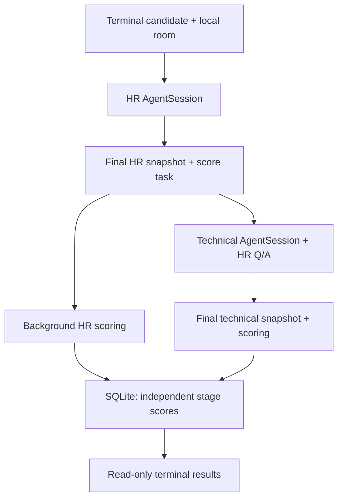

# Main Plan: Local Voice Interview Agent

Version 2.0 specification. `PROGRESS.md` is the authoritative completion audit; this file defines
the required product and phase sequence.

## 1. Objective

Build a local Python application that conducts a short English voice interview from the terminal. The candidate enters only a name. One LiveKit room hosts two sequential interview stages, each with its own AgentSession and Agent. HR scoring runs concurrently with the technical interview. Store interview evidence and independent stage scores locally and expose them through read-only terminal commands.

## 2. Fixed requirements

| ID | Requirement |
|---|---|
| R01 | New Python project on Ubuntu 26; discover the exact release and architecture during P00. |
| R02 | LiveKit Server and Agent Server run locally. Use LiveKit CLI. No AWS or LiveKit Cloud deployment. |
| R03 | One active interview at a time. Candidate input is name only; generate internal IDs. |
| R04 | One room and continuous candidate connection across normal stage handoff. Two separate AgentSessions and two different Agents. |
| R05 | HR first: collaboration, ownership, receiving feedback, conflict handling; ask about real situations. |
| R06 | Staff Engineer second: APIs, databases, debugging, system design, and reasoning/problem-solving/decision justification. General backend engineering, not a specific stack. |
| R07 | Generate questions dynamically. Use different technical cases, start at Junior difficulty, and adapt upward to observed ability. Small hints allowed and recorded. |
| R08 | Each stage targets five active minutes. Let the candidate complete the current answer; do not ask a new question after the deadline. |
| R09 | English only. Do not score English grammar, accent, or fluency. |
| R10 | Allow interruptions. Check in after five seconds of genuine idle time; wait longer when thinking time is requested. |
| R11 | ElevenLabs for streaming STT and TTS; a distinct configured voice for each agent. |
| R12 | Sonnet 5 through OpenRouter for every LLM task, including question generation, assessment and narrative summary. No automatic model substitution. |
| R13 | After HR, persist its evidence and start its scoring without delaying the technical interview. Technical Agent can access HR Q/A. |
| R14 | Score each assessed competency 1–5, with evidence. Equal weights within each stage. Each stage has its own score; no combined score. Unassessed is null, not zero. |
| R15 | Persist audio, transcripts, questions, answers, hints, timestamps, events, scoring and evidence. SQLite holds records; local files hold audio. |
| R16 | Retain interview data for 30 days, then delete associated local data and recordings automatically. |
| R17 | Read-only terminal results commands only. The application serves no HTTP interface and has no web UI of any kind (see docs/adr/0001-terminal-only-operator-interface.md). |
| R18 | Try to resume transient connection/provider failures for up to two minutes, pausing the active stage timer. Otherwise preserve an incomplete interview. |
| R19 | No in-agent recording-consent step in this prototype, as requested. |

HR is a job-related behavioral interviewer, not a diagnostic psychologist. Scores describe evidence in the answers; they must not infer mental health or personality from voice. The system does not automatically make employment decisions. Ten minutes supports a limited screening result, not an exhaustive certification of seniority.

## 3. Implementation defaults, not additional user decisions

- Use one ROOM-type job and one JobContext for both stages in normal operation. This is this application's design, not a global LiveKit restriction.
- Start the stage timer at the first substantive question. Exclude greeting, handoff and recovery; include normal thinking time.
- A question already delivered at the deadline may receive its answer. No additional follow-up afterward.
- Extend the idle reminder by an initial configurable 20 seconds when the candidate explicitly asks to think. This does not reset the stage timer.
- Keep scores out of the technical interviewer's context. Share HR Q/A as attributed data, not HR instructions or tools.
- Use a separate local scoring worker with a SQLite-backed task queue. It may continue when the voice job exits.
- Use one small hint per technical case as the initial policy; record the assistance and judge what the candidate subsequently achieves.
- Retention expires 30 days after interview start in UTC. Cleanup catches up when the machine next runs.
- Use a Python terminal RTC client only if the installed CLI cannot provide bidirectional microphone audio inside a real room. Keep LiveKit CLI for scaffolding, room management and dispatch.

These defaults are explicit so Codex can proceed without another requirements interview. Material deviations require a documented decision, not a silent workaround.

## 4. Architecture overview

Application-owned logic controls the interview stages, timing, question policy, scoring, storage and presentation. LiveKit handles RTC room/media and agent job infrastructure. ElevenLabs and OpenRouter are external network services even though the rest runs locally.

The sessions do not speak concurrently. The parallel activity is scoring, which does not own RoomIO or a voice session. See ARCHITECTURE.md for exact ownership, dependency and persistence contracts.

## 5. Phase order

| Phase | Subplan | Dependencies | Exit outcome |
|---|---|---|---|
| P00 | [Compatibility](plans/P00_COMPATIBILITY.md) | None | Verified local tool/provider/audio capabilities or explicitly blocked live gates |
| P01 | [Scaffolding](plans/P01_SCAFFOLDING.md) | P00 environment findings | Clean package, ports, config and quality tooling |
| P02 | [Persistence and recording](plans/P02_PERSISTENCE.md) | P01 | Durable turns, snapshots, queue and audio manifests |
| P03 | [Lifecycle and handoff](plans/P03_HANDOFF.md) | P01–P02 | Two sessions in the same real room, single I/O owner |
| P04 | [Voice and timing](plans/P04_VOICE_TIMING.md) | P03 | Interruption, idle and deadline behavior |
| P05 | [HR interview](plans/P05_HR.md) | P04 | Real-situation behavioral questions and evidence |
| P06 | [Technical interview](plans/P06_TECHNICAL.md) | P04–P05 | Adaptive different cases, hints and observed boundaries |
| P07 | [Scoring](plans/P07_SCORING.md) | P02, P05–P06 contracts | Recoverable background assessment, separate scores |
| P08 | [Recovery and retention](plans/P08_RECOVERY_RETENTION.md) | P03–P07 | Two-minute recovery and 30-day expiry |
| P09 | [Results](plans/P09_RESULTS.md) | P07–P08 | Read-only terminal results with evidence and resolved recording paths |
| P10 | [Acceptance and runbook](plans/P10_ACCEPTANCE.md) | All previous | Verified local workflow and honest final report |

Queue contracts and a fake scoring consumer exist before P07 so P03 can prove nonblocking handoff. P07 replaces the fake with real validated LLM scoring. If a live preflight gate is blocked, dependency-independent implementation may continue with fakes; no corresponding live gate is considered passed.

## 6. Milestones

1. **M1 — Feasibility:** verify the local control plane, SDK lifecycle, providers, and physical
   audio path.
2. **M2 — Foundation:** establish package boundaries, durable evidence, recording, and queue
   contracts.
3. **M3 — Interview:** prove the two-session interview, timing, and same-room media handoff.
4. **M4 — Assessment:** prove durable independent scoring and calibration.
5. **M5 — Operational prototype:** prove recovery, retention, results, the runbook, and final live
   acceptance.

## 7. Final acceptance

- Real terminal microphone and playback participate in a local room; no browser dependency anywhere in the workflow.
- Normal handoff preserves room SID and candidate identity, creates a distinct technical AgentSession, and leaves no overlapping audio owners.
- HR score generation can be deliberately slow while technical questioning proceeds normally.
- Deadline, final-answer completion, interruption, idle reminder and thinking-time behavior match policy.
- Technical cases adapt in difficulty and record hints; HR uses real situations. English quality does not affect scores.
- Every numeric competency score has valid transcript evidence; null competencies are excluded from the average and included in coverage reporting.
- SQLite and audio survive normal restart; recovery preserves stage progress where possible and records gaps honestly.
- A 120-second recovery failure yields an incomplete conversation; scoring failure alone does not.
- Expired data disappears from the results commands and is removed by the local cleanup workflow, including recordings and derived files.
- Terminal output renders untrusted content safely: control and ANSI sequences cannot be injected, recordings resolve only under the owned data root, and no secrets are printed.
- Ruff, mypy, relevant pytest suites and architecture boundary checks pass. Real-device/provider checks are separately documented.
- The runbook states versions, setup, configuration, startup order, candidate invocation, results access, restart/recovery, cleanup and shutdown.

## 8. Completion and scope control

No multi-candidate scaling, CV ingestion, fixed question bank, automated hiring decision, cloud deployment, external database, any web or HTTP interface, or additional AI provider is required. Do not add these to satisfy a personal architecture preference.

For each phase, record implementation status and verification status separately in PROGRESS.md. The phase is complete only when its applicable gate is proven. Do not represent the presence of files as proof the interview works.
